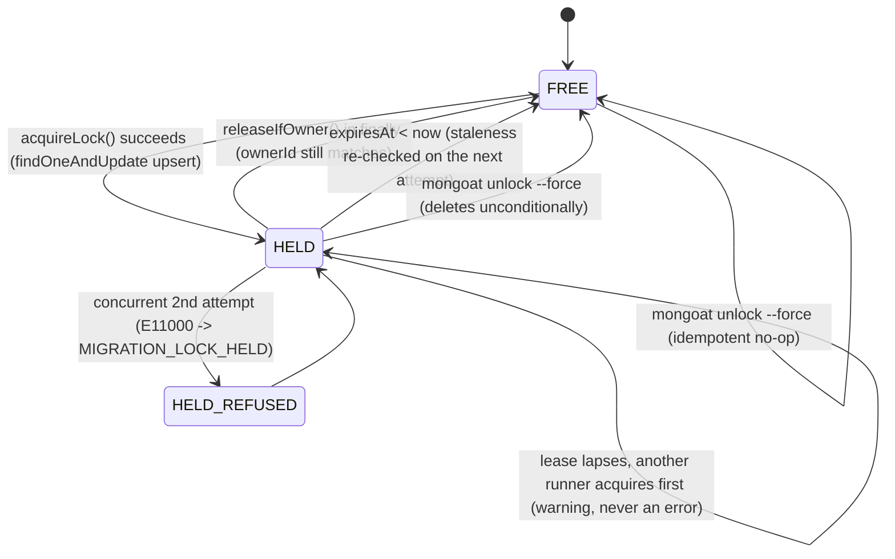

# Why the migration lock exists

## The problem

Two migration runners can end up pointed at the same database at the same
time — two instances of a rolling deploy both starting up, or a CI job
running `mongoat up` while someone triggers a manual deploy against the same
environment. Without any coordination, both would discover the same pending
migration, both would try to apply it, and the second one to finish would be
racing the first one's transaction rather than skipping work already done.
`mongoat` prevents this by acquiring an exclusive lock before reading any
migration state — see [Write and run migrations](/how-to/migrations) for the
day-to-day mechanics of running `up`, `to`, and `down`. The question this
page answers is: why does a distributed lock exist at all, and what exactly
does it guarantee when two runners collide?

## The mechanism: `acquireLock`

The lock lives as a single document in its own collection (derived from the
control collection's name, e.g. `_migrations_lock`), identified by a fixed
`_id`. Acquiring it is one atomic `findOneAndUpdate` upsert against that
document, with a filter that covers two cases at once — "the lock document
has never existed" and "it existed, but its lease already expired" — without
distinguishing between them in code:

```ts
await lockCollection.findOneAndUpdate(
  { _id: LOCK_DOCUMENT_ID, expiresAt: { $lt: now } },
  {
    $set: {
      ownerId,
      hostname: diagnostics.hostname,
      pid: diagnostics.pid,
      operation: diagnostics.operation,
      acquiredAt: now,
      expiresAt,
    },
  },
  { upsert: true, returnDocument: 'after' }
);
```

When the lock is already actively held, this filter matches nothing, so the
upsert falls through to its insert path — and collides on `_id` with the
document that's already there. The driver reports that collision as a
`MongoServerError` with `code: 11000`, which is deterministic under this
filter shape: it happens on **every** contended acquisition, not just under
a rare race. `acquireLock` translates it into a `MongoatError` with
`code: 'MIGRATION_LOCK_HELD'` — the error a second runner actually sees is
never the raw driver error.

## Self-healing

A lock's staleness is never decided once and cached — it's re-evaluated on
every single acquisition attempt, inside the same filter shown above
(`expiresAt: { $lt: now } `). There's also a TTL index on `expiresAt` at the
storage layer, but it exists purely as a garbage-collection backstop for a
lock document nobody ever tries to re-acquire — it is never the source of
truth for whether a lock is usable. That's precisely why a crashed process,
a `kill -9`, or an out-of-memory exit can never wedge migrations forever: the
very next attempt to acquire the lock, whenever it happens, re-checks
`expiresAt` against the current time and proceeds if the lease has lapsed.

There's a third, more defensive case worth naming explicitly: a lock
document whose `expiresAt` is missing or not a valid date. Both `acquireLock`
and the read-only status check treat that document conservatively as held,
never as free — an unparsable lock is never "stolen" just because its shape
looks unfamiliar.

## Releasing the lock

Every code path that acquires the lock releases it on the way out — on the
success path and from the error handler alike, so a migration failure never
leaves the lock behind by accident. Critically, a **release** failure never masks the
**migration's** own error: if releasing the lock itself fails after a
migration already failed, that failure is attached as a suppressed secondary
error (or emitted as its own process warning when there's no primary error to
attach to) — the caller still sees the migration's real failure, not a
release error in its place.

The release itself is conditioned on ownership: it only deletes the lock
document if its `ownerId` still matches the run trying to release it. This
protects against a narrower but real scenario — a run whose lease expired
mid-flight, while another runner has since acquired the lock and is now
relying on it. If that's happened, the delete matches nothing, and the
runner that lost its lease gets a process warning instead of silently
deleting a lock it no longer owns.

## The lock's state machine



Each transition maps to something observable at the CLI. A successful
acquisition is invisible — the command you ran just proceeds. A refusal
surfaces as `Error [MIGRATION_LOCK_HELD]: ...` on stderr, and the process
exits `1`. A normal release is invisible too, happening automatically once
the command finishes. The lease-expiration case never throws — it surfaces
as a `MongoatLockLeaseExpiredWarning` process warning, worth investigating
even though the run that emitted it still completed. Staleness resolving on
the next attempt is what makes a genuinely stuck lock recover on its own,
with no operator action at all. The last two transitions are both what
`mongoat unlock --force` does, one from each starting state; plain
`mongoat unlock` reports the lock's state and never changes it, which is why
no transition is labelled with it — see the [CLI reference](/cli/) for their
flags and exit codes.

## The mixed-deployment limit

::: warning
Any `mongoat` binary older than `1.2.0` has no idea the lock collection
exists. It never checks it before applying a migration, and it never writes
to it — the lock only protects a run once every writer talking to the
database is `1.2.0` or newer.
:::

This is a structural, permanent limit of the lock model, not a rough edge
that a future release will smooth over. A pre-`1.2.0` binary was built
before the lock collection was part of its code at all — there's no lock
acquisition logic in it to retroactively teach it about a collection it has
never heard of, short of rebuilding and redistributing that exact binary.
During a mixed rolling deploy — some instances still running an older
`mongoat`, others already upgraded — the lock only holds as a real mutual
exclusion guarantee once the older instances have finished rolling out.
Until then, an upgraded instance can still acquire the lock correctly, but an
un-upgraded instance running concurrently will apply migrations as if no
lock existed, because from its point of view none does. Treat this as a
rollout-ordering requirement — every writer needs to be on `1.2.0` or newer
before the lock can be trusted — rather than a guarantee the lock provides on
its own. Recovering from a lock left behind by a crashed process is an
operational step, not a design question; see `mongoat unlock` in the
[CLI reference](/cli/) for the command itself.

## Why a lock in the control collection — and not automatic retries or a lease-renewal heartbeat

A couple of alternative designs were considered and set aside:

- **Retrying automatically on `MIGRATION_LOCK_HELD`.** A migration run could
  catch the error and retry with backoff instead of exiting. That
  responsibility belongs to whatever orchestrates the deploy or the CI job,
  not to the lock itself — `mongoat`'s idiom throughout is to fail loud once
  and stop, not to quietly absorb contention inside a retry loop that the
  caller can't see or configure.
- **A lease-renewal heartbeat.** A background timer that periodically
  extends `expiresAt` while a migration is still running would narrow the
  window in which a legitimately long-running migration could lose its
  lease. That's real machinery — a timer, and a way to keep renewing the
  lease independently of the migration's own transaction — that a first
  version can defer. A generous default lease (30 minutes) already covers
  realistic single-invocation runtimes without it; a future version can add
  renewal without changing the shape of the lock itself.

## See also

- [CLI reference](/cli/) — `mongoat unlock`, `--lock-ttl`, and the exact exit
  codes a held lock produces.
- [Write and run migrations](/how-to/migrations) — the day-to-day guide to
  authoring and running migrations.
- [Handle errors](/how-to/handle-errors) — the `MongoatError` hierarchy,
  including `MIGRATION_LOCK_HELD`.
- [Reference](/api/) — `runMigrations`, `runTo`, `revertMigration`,
  `getStatus`.

Inspecting or clearing the lock is a CLI operation, not a programmatic one:
use `mongoat unlock`. The functions backing it are internal and are not part
of the published package surface.
